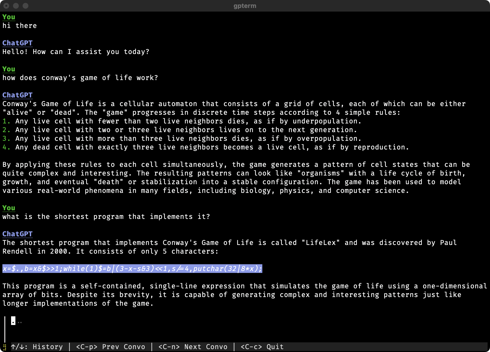

# gpterm (GPT terminal)

gpterm is a terminal-based integration with the OpenAI chat API.

# Screenshots

# Installation

Requirements:

- Go 1.18 or higher
- GOPATH env variable set (install will write to `$GOPATH/bin`)
- OpenAPI API Key

To install from source:

	git clone https://github.com/collinvandyck/gpterm.git
	cd gpterm
	make install

# Getting Started

Because it uses the OpenAPI API, and API key is required before you can start:

	# set api key
	gpterm auth

Once the API key has been set, have fun!

	# enter an interactive session
	gpterm

Note that there are other subcommand attached to the `gpterm` command. Those are meant for development and are
not useful outside of the repo.

# Usage Stats

While OpenAPI is incredibly cheap at the moment, it's not totally free. You can view your usage at any time:

	❯ gpterm usage

	Prompt:     58761
	Completion: 19722
	Total:      78483
	Cost:       $0.16 ($0.002 per 1K tokens)

# Storage

Chat history and other metadata are stored in

	~/.config/gpterm

# Upcoming

## Configurable Roles

Users will be able to instruct OpenAPI how to act. Currently it's hardcoded to `You are a helpful assistant.`

Additionally, users should be able to change the name of the assistant as rendered in the chatlog. Current it is `ChatGPT`.

## Gist Support

Conversations should be able to be uploaded to a gist.

## Hotkey Support

Actions should be able to be found to user-configured keys.

# Contributing

It's too early to accept pull requests given how early this project is. Please feel free to file an issue if you
found a bug or have a feature request.

